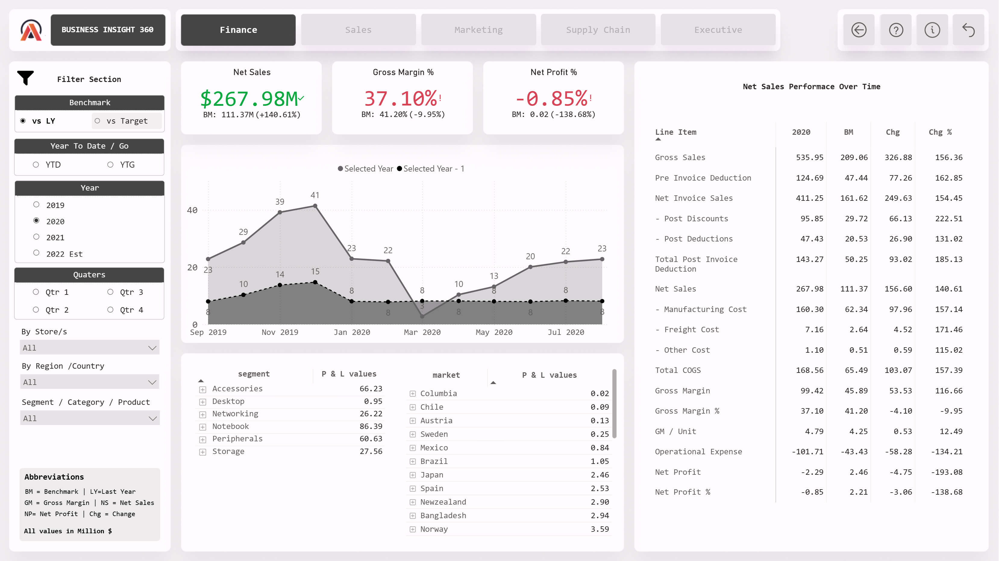
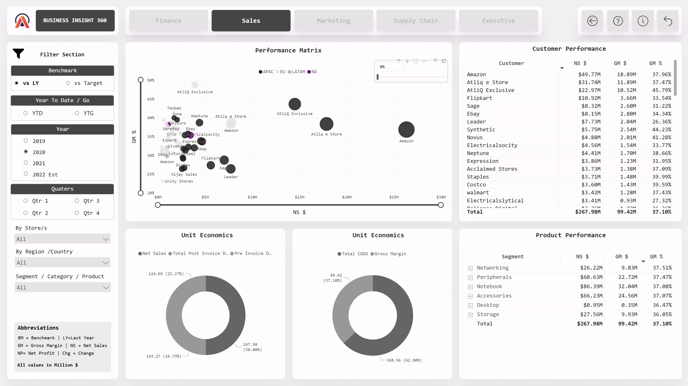
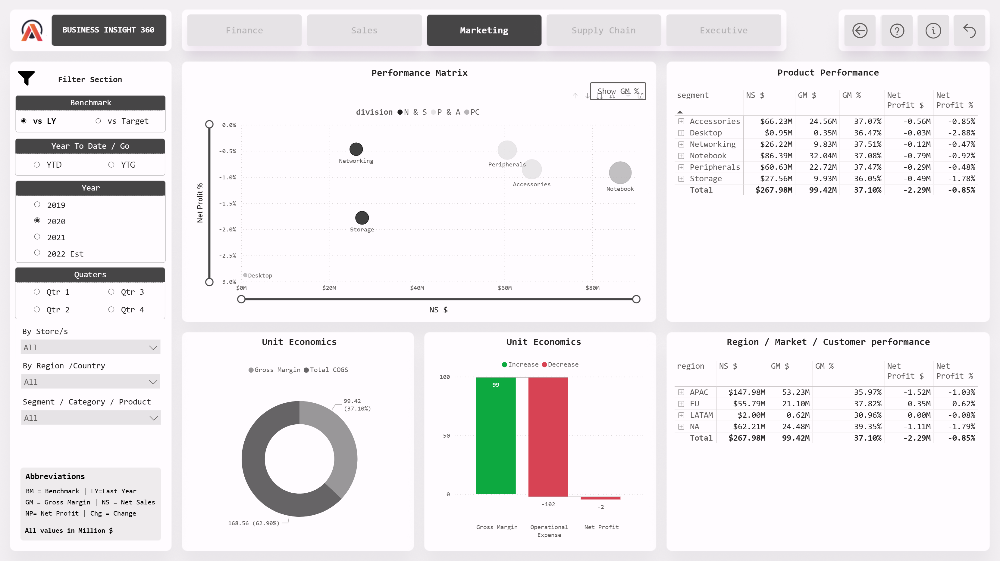
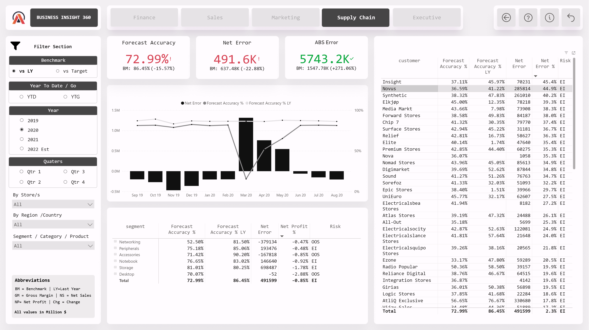
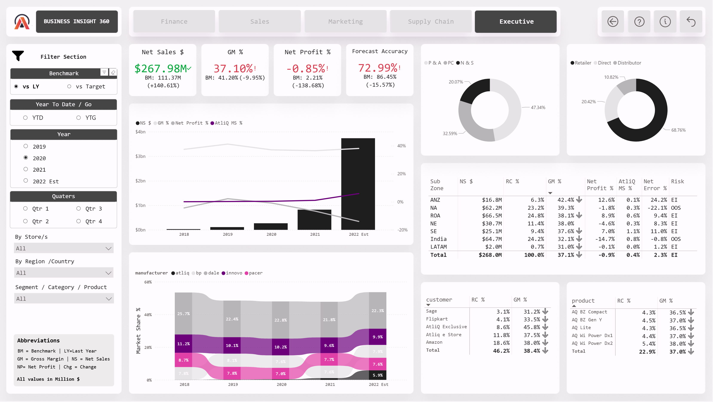

# AtliQ Business Insights 360

**An end-to-end Power BI dashboard suite built for AtliQ Hardware — transforming raw data into actionable business intelligence across Finance, Sales, Marketing, Supply Chain, and Executive functions.**

🔗 **[Live Dashboard →](https://app.powerbi.com/view?r=eyJrIjoiYTUyNzU4NjYtNTRlOS00ZWI1LWJiYzktYjllZjRiNWQ4YWMwIiwidCI6ImM2ZTU0OWIzLTVmNDUtNDAzMi1hYWU5LWQ0MjQ0ZGM1YjJjNCJ9)**

---

## Company Background

AtliQ Hardware is one of the fastest-growing electronics companies, manufacturing and selling PCs, mice, printers, and other electronic goods globally. Products reach consumers through three channels:

- **Retailers**: Brick & mortar stores (Chroma, Best Buy) and e-commerce platforms (Amazon, Flipkart)
- **Direct**: AtliQ's own exclusive stores
- **Distributors**: Regional distribution partners handling logistics in regulated markets like China and South Korea

After suffering significant losses from a failed Latin America expansion driven by decisions based on surveys and gut instinct rather than data AtliQ's leadership made data analytics adoption their top strategic priority. This project was born from that initiative.

## Problem Statement

AtliQ Hardware was relying on Excel-based reporting and regional manager phone calls to make critical business decisions. This led to:

- Biased "rosy picture" reporting from regional teams
- Inability to quickly identify underperforming markets and products
- No standardized, company-wide view of business health
- Costly strategic missteps (Latin America expansion)

Meanwhile, competitors like Dell were leveraging sophisticated analytics teams to gain market advantage.

## Solution

A comprehensive Power BI dashboard suite **Business Insights 360** delivering five interconnected views that enable data-driven decision-making from the CEO level down through every department.

## Dashboard Views

### 📊 Finance View
- P&L statement from gross sales through to net profit
- Year-over-year and budget vs. actual comparisons
- Top/bottom products and customers by profitability

### 💰 Sales View
- Customer performance matrix with net sales and gross margin analysis
- Unit economics breakdown across channels and regions
- Key account profitability tracking

### 📢 Marketing View
- Product-level performance analytics
- Segment and category-wise profitability
- Region/market/customer performance benchmarking

### 🚚 Supply Chain View
- Forecast accuracy and net error trends
- Risk profiles for out-of-stock (OOS) and excess inventory situations
- Key metrics by customer and product to optimize supply planning

### 🏢 Executive View
- High-level consolidated dashboard for C-suite stakeholders
- Revenue breakdown by division, channel, and customer
- Top 5 customers and products by revenue with year-over-year trends
- Market share analysis across sub-zones

## Data Model & Technical Details

**Data Sources:** MySQL database, Excel/CSV files

**Key Technical Skills Applied:**
- Power Query for data extraction and transformation (ETL)
- DAX measures and calculated columns for business logic
- Data modeling with star and snowflake schemas
- Performance optimization using DAX Studio
- Dynamic titles, KPI indicators, and conditional formatting
- Bookmarks and page navigation for seamless user experience
- Published to Power BI Service with auto-refresh configuration

**Core Business Metrics Implemented:**
- Gross Sales, Pre/Post-Invoice Deductions, Net Sales
- COGS, Gross Margin, Gross Margin %
- Net Profit, Net Profit %
- Forecast Accuracy, Net Error, Absolute Error
- YTD / YTG breakdowns

## Key Business Insights

- Identified underperforming regions and customer segments contributing to margin erosion
- Surfaced forecast accuracy gaps driving excess inventory costs
- Enabled leadership to independently assess business health via daily dashboard reviews replacing manual calls to regional heads
- Provided negotiation leverage for key account discussions with data-backed profitability analysis

## Project Approach

- **Duration:** 8 weeks, Agile methodology with MVP at week 4
- **Validation:** Multi-level data validation against benchmark quarterly financials, stakeholder UAT sign-off across all departments
- **Goal:** 10% profit margin improvement through data-driven optimization

## Tools & Technologies

| Category | Tools |
|---|---|
| Visualization | Power BI Desktop, Power BI Service |
| Data Processing | Power Query, DAX, DAX Studio |
| Database | MySQL |
| Supplementary | Excel, CSV |
| Project Management | Agile / Scrum |

## Screenshots

## How to Use

1. Click the **[Live Dashboard](https://app.powerbi.com/view?r=eyJrIjoiYTUyNzU4NjYtNTRlOS00ZWI1LWJiYzktYjllZjRiNWQ4YWMwIiwidCI6ImM2ZTU0OWIzLTVmNDUtNDAzMi1hYWU5LWQ0MjQ0ZGM1YjJjNCJ9)** link to explore the interactive report
2. Use the navigation tabs to switch between Finance, Sales, Marketing, Supply Chain, and Executive views
3. Apply filters (region, market, customer, time period) to drill into specific segments
4. Hover over visuals for detailed tooltips and insights

## Connect with Me

---

*If you found this project useful, consider giving it a ⭐!*
